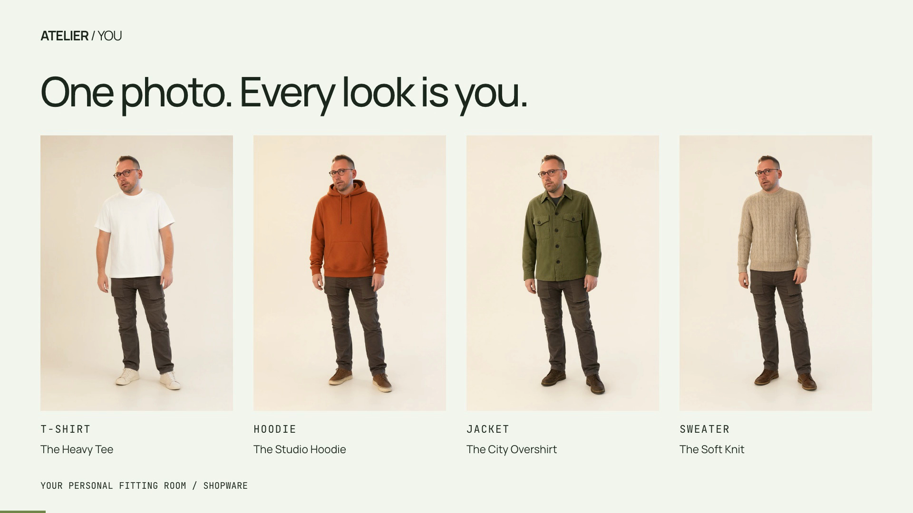
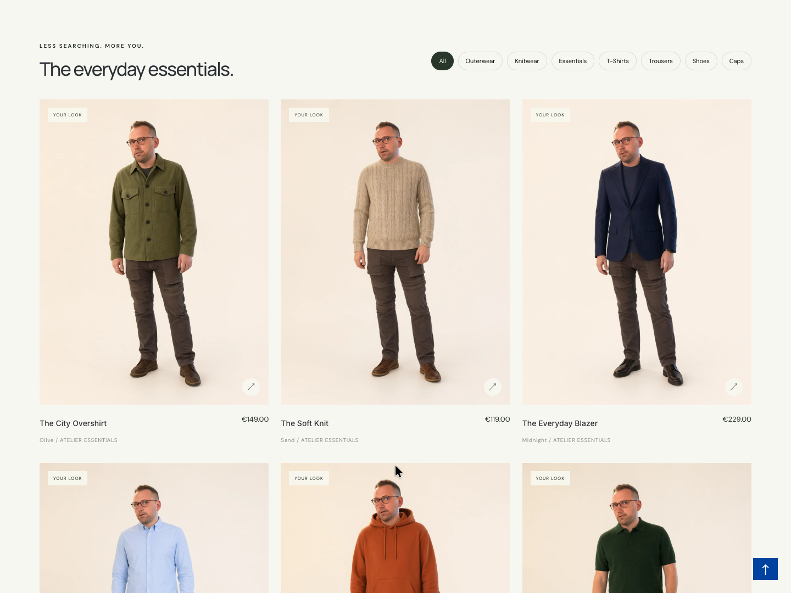

# ATELIER / YOU

A self-hosted virtual try-on prototype for Shopware. Upload one photo and see yourself wearing different products throughout the storefront, or combine multiple items into an outfit. Image generation runs on your own NVIDIA GPU with Qwen-Image-2.1.

This repository contains the storefront plugin, image API and demo catalog setup. It is an evaluation project with synthetic merchandise and no ordering flow; there is no hosted service or public live demo.

**Watch here:** the 12-second GIF plays directly in this README. [20-second video with sound](https://github.com/sthamann/atelier-you/releases/download/v0.4.0/atelier-you-one-photo-every-look.mp4) · [Video and complete editable project](https://github.com/sthamann/atelier-you/releases/tag/v0.4.0)

**One upload. Every product becomes personal.** The walkthrough shows the same photo used for a T-shirt, hoodie, jacket and knit sweater, with a personalized collection and four real product pages.

*Recorded in the real English-language Shopware storefront, using one photo upload in one session. The catalog shows actual before/after states; generation waiting time is omitted and labelled. The product-page sequences display previously generated results. The edit does not imply instant generation.*

## Run it on your infrastructure

You need access to an NVIDIA GPU machine, a dedicated Shopware development installation and the model weights. Your own workstation or a rented GPU server can host the image service; you do not need access to the machine used for the video.

- **Tested setup:** Linux, Python 3.12, CUDA 13-compatible NVIDIA driver, Shopware 6.6.10.6 and one RTX PRO 6000 with 96 GB VRAM. Inference used approximately 31.7 GB of VRAM in this setup; that is an observation, not a validated minimum GPU requirement. Other GPU configurations have not been verified.
- **Installation:** follow [Installation and operation](docs/DEPLOY.md) to download the pinned model, generate the catalog, install the plugin and connect Shopware to the API.
- **Configuration:** choose your GPU, storage paths and storefront origin. Shopware forwards `/tryon/` to your image service. The guide explicitly overrides the original deployment defaults.
- **Existing stores:** the included installer and seed are prototype helpers for a dedicated development shop. Adapting an existing merchant catalog requires product-reference synchronization and deployment work.

Once installed, use your own storefront URL. Outfit Studio is at `/?outfit=1`, and service health is at `/tryon/health` on that same origin. API documentation is available at `/docs` on your internally reachable API service.

## Shopper experience

1. Open a product and select **See it on me**.
2. Upload your photo. A well-lit, full-length picture provides the best reference; the AI fills in hidden or missing areas.
3. While the image is being created, light moves across the slowly fading product image. The completed result is revealed once it has loaded.
4. Switch between **Front**, **Side**, **Back** and **View original**. Other product pages reuse your session and completed images.
5. In **Outfit Studio**, combine a top, jacket, trousers, shoes and cap. Any category can be left empty. **See this outfit on me** generates the complete look together.
6. Select **Your look is ready** to replace your photo or delete your session, photo and generated looks.

One photo across multiple products

## What is included

A generator and seed script for 17 actual Shopware demo products: two jackets, seven tops including three T-shirts, three pairs of trousers, three pairs of shoes and two caps. Each has a product record, price, cover image and Shopware product detail page. The merchandise and product images are synthetic demo references.

A FastAPI service handles uploads and a persistent SQLite queue. One resident model runs on one GPU. Requested products take priority over background jobs that have not started. Results are reused by session, product combination, view and generation version, so returning to a product does not generate a new image.

On the tested RTX PRO 6000, measured image generation took **8.4 seconds** for the tested overshirt, **14.2 seconds** for the front view of the five-piece outfit and approximately **6.1 seconds** for each additional outfit view. Queueing, upload, polling and transitions add to these times. These are single-session measurements, not a load-test or multi-user guarantee.

## Face reference and reveal

Visual review of the original outfit demo confirmed facial drift. The revised pipeline uses a detected face crop as its first reference and prioritizes facial features, glasses, hairline and head orientation. It skips ambiguous detections. Side and back views rotate the completed front-view image as their single reference; multiple person references had produced duplicate people in an intermediate experiment. Cache keys include the generation version so older results do not hide pipeline changes.

The old image fades out over 180 ms, then the loaded new image fades in over 550 ms. This prevents two faces from appearing on top of each other. Identity is still not guaranteed: the model regenerates the face, and expressions or individual features can change.

## Limitations and privacy

This is an AI visualization, not a clothing-size or physical-fit measurement. Side and rear views are plausible interpretations of the available images. Product details and identity may vary across views. Incomplete reference photos require the model to invent missing body areas; the recorded demo illustrates this with generated lower legs and feet.

The pinned Qwen-Image-2.1 version uses a research license for noncommercial use. The prototype is intended for evaluation. Commercial deployment requires a separate review of model rights: [model and license](https://huggingface.co/Qwen/Qwen-Image-2.1).

Runtime customer photos and results are stored in your deployment’s data directory, outside public Shopware media. Access requires the owner’s HttpOnly session cookie. Sessions expire after 24 hours and can be deleted immediately. Demo images and recordings distributed with this repository are separate, consented examples; they are not needed to run the application and do not expire with runtime sessions.

The installation guide targets local development. Public operation requires HTTPS, secure cookies, access and usage controls, an appropriate Shopware deployment and review of model rights; see [deployment considerations](docs/DEPLOY.md#before-public-operation).

## Development and operation

- [Architecture](docs/ARCHITECTURE.md)
- [Installation and operation](docs/DEPLOY.md)
- [Verification](docs/VERIFICATION.md)
- [Third-party software and media](docs/THIRD_PARTY.md)
- [Media and reproduction](docs/MEDIA.md)

`api/` contains the image service, `shopware/AtelierYou/` the storefront plugin, `scripts/` the reproducible catalog setup and `videos/atelier-you/` the demo composition. The README GIF is tracked in Git. The [demo media release](https://github.com/sthamann/atelier-you/releases/tag/v0.4.0) includes the video and the media needed to edit and render it. Credentials, runtime customer sessions and model weights are excluded.
