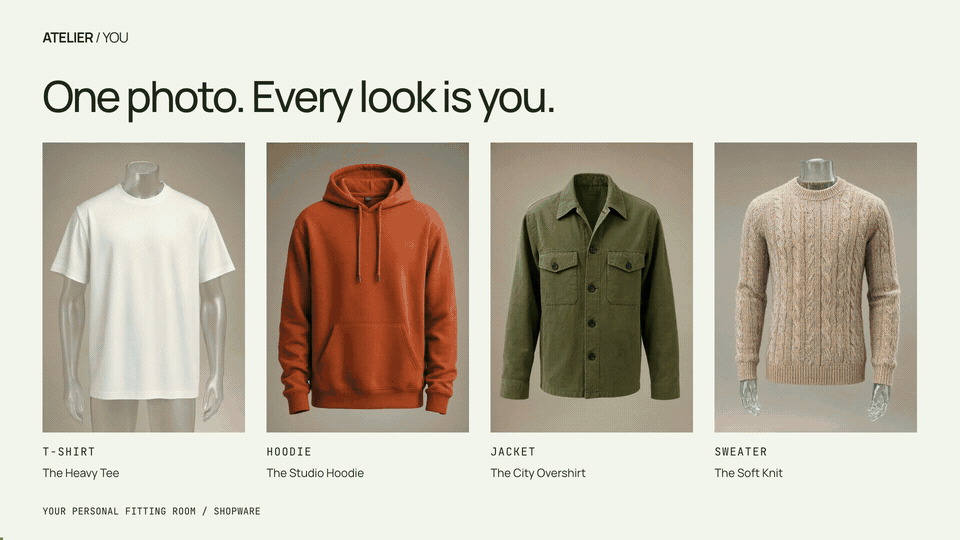
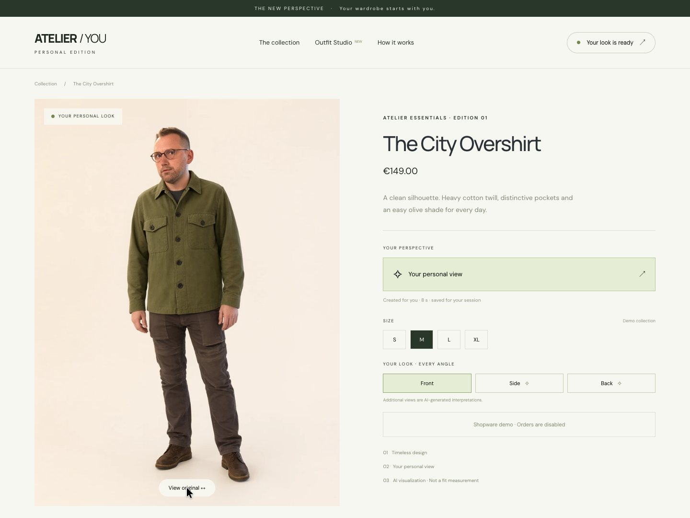
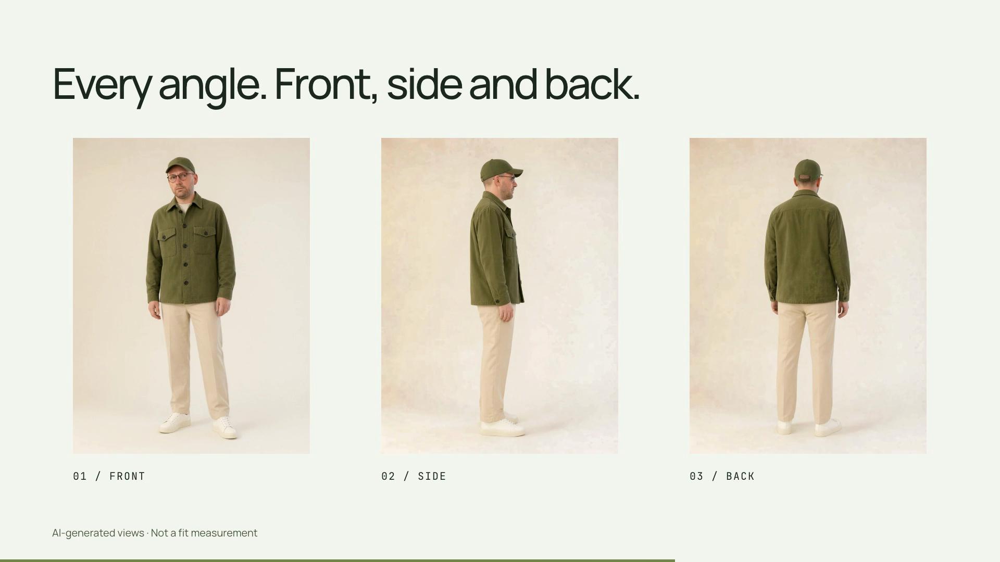

# ATELIER / YOU

A real Shopware storefront that turns your uploaded photo into your personal fashion model. Qwen-Image-2.1 runs locally on the demo server’s RTX PRO 6000. This private evaluation demo uses a fictional fashion collection and does not accept orders.

**Watch here:** the 12-second GIF plays directly in this README. [20-second video with sound](https://github.com/sthamann/atelier-you/releases/download/v0.3.0/atelier-you-demo-en.mp4) · [Video and complete editable project](https://github.com/sthamann/atelier-you/releases/tag/v0.3.0)

*Recorded in the real English-language Shopware storefront. The outfit-generation wait is accelerated and labelled on screen. The video includes a cached result and a shortened generation sequence; it is not an uninterrupted real-time recording.*

- **Shop:** http://192.168.1.120:8090/
- **Outfit Studio:** http://192.168.1.120:8090/?outfit=1
- **API documentation:** http://192.168.1.120:8091/docs
- **Status:** http://192.168.1.120:8090/tryon/health

These addresses are accessible on the local network.

## Try it

1. Open a product and select **See it on me**.
2. Upload your photo. A well-lit, full-length picture provides the best reference; the AI fills in hidden or missing areas.
3. While the image is being created, light moves across the slowly fading product image. The completed result is revealed once it has loaded.
4. Switch between **Front**, **Side**, **Back** and **View original**. Other product pages reuse your session and completed images.
5. In **Outfit Studio**, combine a top, jacket, trousers, shoes and cap. Any category can be left empty. **See this outfit on me** generates the complete look together.
6. Select **Your look is ready** to replace your photo or delete your session, photo and generated looks.

English storefront and generated views

## What is included

17 actual Shopware products: two jackets, seven tops including three T-shirts, three pairs of trousers, three pairs of shoes and two caps. Each has a product record, price, cover image and Shopware product detail page. The merchandise and product images are synthetic demo references.

A FastAPI service handles uploads and a persistent SQLite queue. One resident model runs on one GPU. Requested products take priority over background jobs that have not started. Results are reused by session, product combination, view and generation version, so returning to a product does not generate a new image.

Measured image generation took **8.4 seconds** for the tested overshirt, **14.2 seconds** for the front view of the five-piece outfit and approximately **6.1 seconds** for each additional outfit view. Queueing, upload, polling and transitions add to these times. These are single-session measurements, not a load-test or multi-user guarantee.

## Face reference and reveal

Visual review of the original outfit demo confirmed facial drift. The revised pipeline uses a detected face crop as its first reference and prioritizes facial features, glasses, hairline and head orientation. It skips ambiguous detections. Side and back views rotate the completed front-view image as their single reference; multiple person references had produced duplicate people in an intermediate experiment. Cache keys include the generation version so older results do not hide pipeline changes.

The old image fades out over 180 ms, then the loaded new image fades in over 550 ms. This prevents two faces from appearing on top of each other. Identity is still not guaranteed: the model regenerates the face, and expressions or individual features can change.

## Limitations and privacy

This is an AI visualization, not a clothing-size or physical-fit measurement. Side and rear views are plausible interpretations of the available images. Product details and identity may vary across views. The selected reference photo does not show the feet or lower legs, so the full-body result generates those areas.

The pinned Qwen-Image-2.1 version uses a research license for noncommercial use. This installation is marked as an evaluation. Commercial deployment requires a separate review of model rights: [model and license](https://huggingface.co/Qwen/Qwen-Image-2.1).

Runtime customer photos and results are stored outside the repository and outside public Shopware media. Access requires the owner’s HttpOnly session cookie. Sessions expire after 24 hours and can be deleted immediately. The personal demo GIF is included in this private README at the user’s explicit request; the video and editable media package are private release assets. These release artifacts are separate from expiring runtime sessions. The LAN demo uses HTTP and is not a public production deployment.

## Development and operation

- [Architecture](docs/ARCHITECTURE.md)
- [Installation and operation](docs/DEPLOY.md)
- [Verification](docs/VERIFICATION.md)
- [Third-party software and media](docs/THIRD_PARTY.md)
- [Media and reproduction](docs/MEDIA.md)

`api/` contains the image service, `shopware/AtelierYou/` the storefront plugin, `scripts/` the reproducible catalog setup and `videos/atelier-you/` the demo composition. The README GIF is tracked in Git. The [private release](https://github.com/sthamann/atelier-you/releases/tag/v0.3.0) includes the video and the media needed to edit and render it. Credentials, runtime customer sessions and model weights are excluded.
